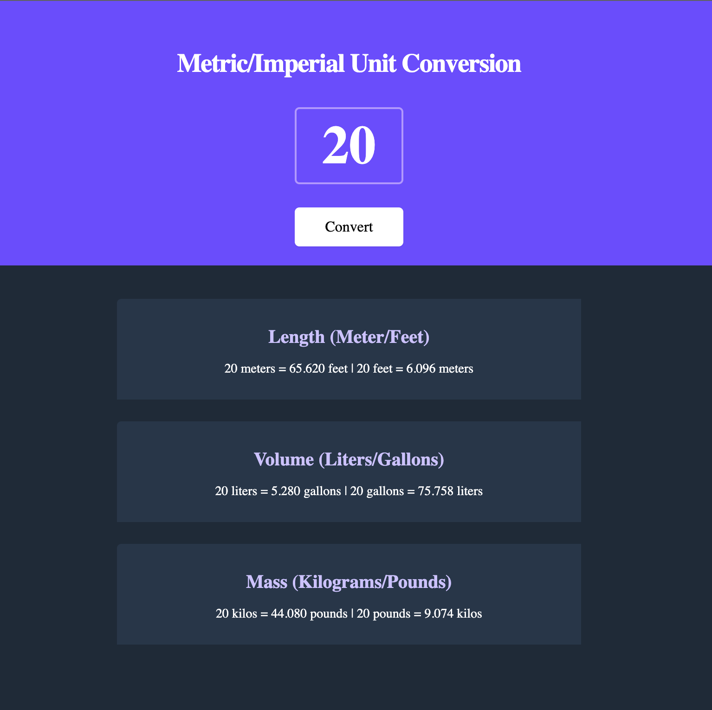

# unitConversion
Unit Conversion App

## Table of contents
* [General info](#general-info)
* [Technologies](#technologies)
* [Functionality](#functionality)
* [Screenshots](#screenshots)

## General info
Designed a simple Unit Conversion application that works with computing length, volume, and mass.

	
## Technologies
Project is created with:
* JavaScript
* HTML
* CSS
*Figma

## Functionality
I used Figma to design the layout of the application and created the layout with HTML and CSS. After creating the layout, I used JavaScript to create the necessary functions that compute length, volume, and mass when a number is put in the textbox and the functional convert button is pressed. <b />

Can convert -
* Meters => feet and feet => meters
* Liters => gallons and gallons => liters
* Kilos => pounds and pounds to kilos
	
## Screenshots

